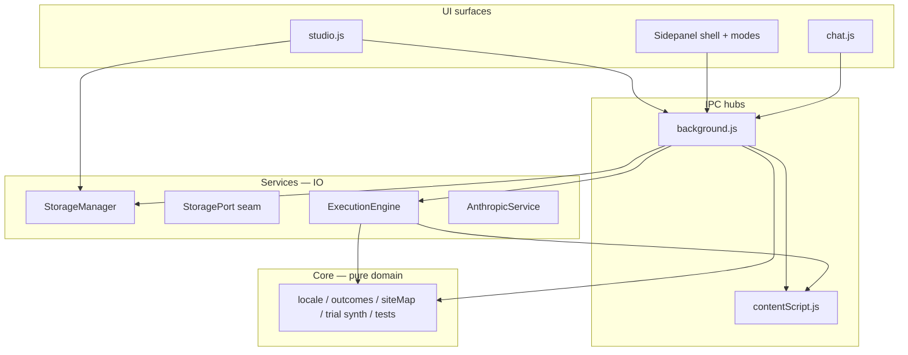

# Code review — release 2.74.605

**Status:** Architecture assessment (read-only review; not a refactor mandate).  
**Extension version:** `manifest.json` → **2.74.605**  
**Review date:** 2026-05-26  
**Scope:** JavaScript sources under the extension repo root, excluding `node_modules`, `.git`, and `infra/orchard-dev/cdk.out`.  
**Relates to:** `Services/Storage/StoragePort.js`, `Sidepanel/shell.js`, `GROUND_SPEC.md`, ongoing Storage seam (M0–M1).

---

## 0. Critical analysis of this review (meta)

This document supersedes an informal chat review. Section 0 records **what the review can and cannot claim**, so readers do not treat line counts as defect counts or treat every large file as equally harmful.

### 0.1 What the original review got right

| Claim | Evidence | Confidence |
|-------|----------|------------|
| A small set of files dominates LOC | Top 8 files ≈ **62%** of measured extension JS when entry points are included | High |
| `background.js` and `contentScript.js` are central coupling hubs | Single `chrome.runtime.onMessage` listener each; 100+ `case` branches (grep undercounts above 100) | High |
| `StorageManager` is a wide persistence API | ~98 `static async` methods; parallel `StoragePort` contract exists | High |
| `Core/` is comparatively well decomposed | Largest Core file ~877 lines; many modules have `*.test.js` | High |
| Sidepanel shell is a reusable pattern | `MODE_REGISTRY`, lazy `import()`, `mount`/`unmount` contract | High |
| Duplication risk on `escHtml` and selector rules | Multiple local `escHtml`; verbatim mirror comment in `contentScript.js` | High |

### 0.2 Methodological limitations (must read before §3–§5)

| Limitation | Effect on conclusions |
|------------|----------------------|
| **Line count ≠ complexity** | A 5k-line prompt table (`AnthropicService.js`) may be low cyclomatic complexity; a 300-line resolver may be worse to change. |
| **Function-size heuristic** | Brace-matching counts **nesting blocks**, not semantic functions; minified-style IIFEs and nested callbacks skew rankings. |
| **`switch` case grep cap** | `background.js` and `contentScript.js` report **≥100** cases; true branch count is higher. |
| **No dependency graph** | Circular imports, fan-in to `StorageManager`, and test coverage per module were not measured. |
| **No runtime profile** | Hot paths (message frequency, storage calls per step) unknown; refactor priority by LOC may mis-rank user-visible latency. |
| **UI verbosity bias** | Large `render*` / `wire*` functions may reflect **template-string UI** without a component layer — splitting into 10×80-line helpers does not automatically improve modularity. |
| **Platform constraints understated** | Content scripts are **non-ESM** in MV3; mirroring `Core/selectorStability.js` is partly forced; build-time bundling is the real fix, not “discipline.” |
| **Intentional migration in flight** | `StoragePort` + partition adapters are **designed partial** extraction, not accidental sprawl; shrinking `StorageManager` must follow the seam doc, not ad-hoc deletes. |
| **LOC rollup double-counts entry files** | `studio.js` / `background.js` appear as top-level files **and** inflate directory totals when summed naïvely. |
| **Tests included in Core totals** | `Core/*.test.js` LOC counts toward “Core health” but are not production coupling. |
| **infra/orchard-dev** | Lambda/CDK files partially scanned; findings focus on **extension runtime**, not cloud stack modularity. |

### 0.3 Corrections to informal severity language

The chat review used **Critical / Severe / Large** primarily by **LOC thresholds**. This spec reframes severity:

| Level | Definition (normative for this doc) |
|-------|-----------------------------------|
| **P0 structural** | Change risk spans multiple surfaces (UI + background + content script + storage) without a contract. |
| **P1 maintainability** | Single-surface monolith; localized edits are error-prone but do not always cross IPC. |
| **P2 hygiene** | Duplication or drift risk; defects are incremental, not architectural. |

**Examples of rescoring:**

- `AnthropicService.js` (6.4k LOC) → **P1** (large, mostly one domain: LLM I/O), not P0 unless prompts are edited alongside execution.
- `TemplateWalker.js` (4.5k LOC) → **P1** (algorithmic walker; splitting may hurt cohesion).
- `escHtml` copies → **P2** (low effort, real drift risk).
- `background.js` message switch → **P0** (touches all features).
- `contentScript.js` + selector mirror → **P0** (runtime correctness + CSP constraint).

### 0.4 What this review did not conclude

- No finding that the extension is “unmaintainable” globally — **Core** and **Sidepanel shell** demonstrate deliberate structure.
- No recommendation to rewrite from scratch.
- No measured defect rate; size is **proxy debt**, not proof of bugs.
- No ranking of **business value** of subsystems (e.g. perspective-capture size may be justified by feature surface until Phase B one-shot orchestration lands).

---

## 1. Purpose and scope

### 1.1 Purpose

Provide a **versioned, auditable** assessment of:

1. **Decomposition** — are concerns separated across layers (`Core`, `Services`, UI surfaces)?
2. **Modularity** — can subsystems change with bounded blast radius?
3. **Reusability** — are shared behaviors centralized or copy-pasted?

### 1.2 In scope

| Path | Role |
|------|------|
| `Core/` | Pure domain + tests |
| `Services/` | Runtime, storage, sync, execution, AI |
| `Sidepanel/`, `Studio/` | Authoring and debug UI |
| `ContentScripts/` | In-page DOM / CSP-safe actions |
| `background.js`, `studio.js`, `chat.js`, `popup.js`, `offscreen.js` | Entry points |
| `shared.js`, `markdown.js` | Shared UI/utilities |

### 1.3 Out of scope

- CSS/HTML asset structure.
- `infra/orchard-dev` except as noted.
- Product feature correctness (Perspective flow, classifier C1–C6).
- Security audit (permissions, CSP) — separate review.

### 1.4 Measurement procedure (repeatable)

```text
1. Enumerate all *.js under repo root excluding node_modules, .git, cdk.out.
2. Record line count = split(/\r?\n/).length per file.
3. Rank files descending.
4. Function scan: brace-depth heuristic; report functions ≥80 lines with file:line.
5. grep case branches: pattern `^\s+case ['"]` (undercounts when >100 matches per file).
6. Manual architecture sampling: background listener, StoragePort header, shell.js registry.
```

**Total measured:** ~109,700 lines across **153** `.js` files (2026-05-26 run).

---

## 2. Architectural assessment

### 2.1 Layer model (as-built)



### 2.2 Modularity scorecard (qualitative)

| Layer | Score | Rationale |
|-------|-------|-----------|
| `Core/` | **Strong** | Small modules, pure functions, co-located tests (`interactionClassification`, `bind`/`cover`/`accept`, `siteMap`). |
| `Sidepanel/shell` | **Strong** | Registry + lazy modes + lifecycle contract. |
| `Sidepanel/modes/*` | **Weak–mixed** | Shell is good; `perspective-capture`, `fragment-author` are monoliths inside good boundaries. |
| `Studio/*Form.js` | **Mixed** | Extraction progress (Strategy, Fragment, …); `StrategyForm` still extreme. |
| `Services/` (flat) | **Weak** | ~40k LOC in flat namespace; few subfolders (`Storage/`, `Cloud/`, `Sync/`). |
| `background.js` | **Weak** | Single listener, 150+ message types, inline explore blocks. |
| `contentScript.js` | **Weak** | Required monolith until bundle strategy exists. |
| `StorageManager` | **Transitional** | God-object **by design** while `StoragePort` migrates; not greenfield debt only. |

### 2.3 Strengths (preserve)

1. **Domain documentation** in `StorageManager` header (primitives vs vocabulary).
2. **Sidepanel mode contract** — template for future splits.
3. **ObservationAuthor/shapes/** — registry of small shape modules.
4. **Storage seam** — `StoragePort.js` §10 typedef as target contract.
5. **Shared capture helpers** — e.g. `ImageReadCapture` used by background and `ExecutionEngine`.
6. **Core/outcomes** stream — separable training/runtime channel.

### 2.4 Structural weaknesses (address)

| ID | Weakness | P-level |
|----|----------|---------|
| W1 | Stringly-typed IPC, no shared message schema | P0 |
| W2 | Dual mega-routers (`background`, `contentScript`) | P0 |
| W3 | Triple storage access (StorageManager, StoragePort partial, SAVE_* messages) | P0 |
| W4 | UI monoliths (`studio`, `perspective-capture`, `StrategyForm`) | P1 |
| W5 | Parallel authoring stacks (Studio forms vs Sidepanel `*-author`) | P1 |
| W6 | Hand-synced Core mirrors in content script | P0 |
| W7 | Local `escHtml` duplication | P2 |
| W8 | `GroundManager` thin wrapper rarely used — inconsistent entry | P2 |

---

## 3. Ranked size anomalies

### 3.1 Files — top 15 by line count

Thresholds (this review only): **Tier A** ≥5,000 · **Tier B** 3,000–4,999 · **Tier C** 1,500–2,999.

| Rank | File | Lines | Tier | P-level | Notes |
|------|------|------:|------|---------|-------|
| 1 | `ContentScripts/contentScript.js` | 8,935 | A | P0 | DOM + selectors + message switch; CSP non-module |
| 2 | `Sidepanel/modes/perspective-capture.js` | 7,602 | A | P1 | Product surface; target orchestration not yet one-shot |
| 3 | `studio.js` | 7,535 | A | P1 | Ground accordion, workflows, conditions |
| 4 | `background.js` | 7,009 | A | P0 | ~5.4k-line effective listener body |
| 5 | `Services/AnthropicService.js` | 6,384 | A | P1 | Prompt/API surface; split by concern not by LOC alone |
| 6 | `Sidepanel/modes/fragment-author.js` | 5,711 | A | P1 | Default export module; huge inner functions |
| 7 | `Services/ExecutionEngine.js` | 5,362 | A | P1 | Runtime orchestration |
| 8 | `Studio/StrategyForm.js` | 5,057 | A | P1 | Worst function-level concentration |
| 9 | `Services/TemplateWalker.js` | 4,498 | B | P1 | Discovery walker — cohesion risk if over-split |
| 10 | `Sidepanel/modes/observation-author.js` | 3,406 | B | P1 | Partially mirrors fragment-author |
| 11 | `Services/StorageManager.js` | 2,868 | C | P0* | *P0 for API width; shrink via Port migration |
| 12 | `Sidepanel/modes/strategy-debug.js` | 1,895 | C | P1 | Debug UI |
| 13 | `chat.js` | 1,825 | C | P1 | Default side panel |
| 14 | `Studio/FragmentForm.js` | 1,758 | C | P1 | Partially extracted |
| 15 | `Studio/AnalysisForm.js` | 1,387 | C | P1 | `saveAnalysis` 428 lines |

**Concentration metric:** Tier A files (1–8) ≈ **62,500** lines ≈ **57%** of total measured LOC.

### 3.2 Functions — top 15 by heuristic span (≥80 lines)

| Rank | Function | Location | Lines | P-level |
|------|----------|----------|------:|---------|
| 1 | `_refreshGroundListImpl` | `studio.js:2561` | 1,261 | P1 |
| 2 | `renderStrategyNodes` | `Studio/StrategyForm.js:2424` | 1,067 | P1 |
| 3 | `wireStrategyStepHandlers` | `Studio/StrategyForm.js:3502` | 815 | P1 |
| 4 | `wireStrategySaveHandler` | `Studio/StrategyForm.js:4329` | 699 | P1 |
| 5 | `explorePageStructure` | `contentScript.js:4716` | 520 | P0 |
| 6 | `_renderActions` | `fragment-author.js:1669` | 473 | P1 |
| 7 | `mount` | `fragment-author.js:876` | 429 | P1 |
| 8 | `saveAnalysis` | `Studio/AnalysisForm.js:776` | 428 | P1 |
| 9 | `handleDomSnapshotRich` | `contentScript.js:3742` | 421 | P0 |
| 10 | `renderPerspectiveLandmarks` | `perspective-capture.js:3144` | 366 | P1 |
| 11 | `evaluateDataCondition` | `Services/DataAssertion.js:146` | 338 | P1 |
| 12 | `startPicker` | `contentScript.js:7458` | 336 | P0 |
| 13 | `mount` | `perspective-capture.js:498` | 323 | P1 |
| 14 | `setupWorkflowsTab` | `studio.js:196` | 319 | P1 |
| 15 | `analyzeStrategyComposition` | `Studio/StrategyForm.js:1037` | 318 | P1 |

**Count ≥80 lines (heuristic):** 126 functions repository-wide.

**Interpretation:** Top UI wiring functions are **P1 maintainability** unless they mix IPC + storage + domain rules (then P0). Prefer extracting **controllers** and **render partials**, not arbitrary 80-line chunks.

### 3.3 Directory rollup (context only)

| Top-level | Lines | Comment |
|-----------|------:|---------|
| `Services/` | 39,836 | Largest bucket; flat namespace dominates |
| `Sidepanel/` | 24,040 | Modes drive bulk |
| `Studio/` | 10,171 | Forms help; `studio.js` extra |
| `ContentScripts/` | 8,935 | Single file |
| `Core/` | 7,925 | Includes tests |
| `studio.js` | 7,535 | Entry — also counted above in spirit |
| `background.js` | 7,009 | Entry |

---

## 4. Reusability and duplication inventory

| ID | Pattern | Canonical location | Copies / mirrors | P-level |
|----|---------|-------------------|------------------|---------|
| D1 | HTML escape | `shared.js` `escHtml` | `markdown.js`, `fragment-author`, `perspective-capture`, `assertion-author`, `analysis-author`, `ground-view`, `ObservationAuthor/*`, inline in `StrategyForm` | P2 |
| D2 | Selector stability rules | `Core/selectorStability.js` | Verbatim in `contentScript.js` (documented hand-sync) | P0 |
| D3 | Primitive CRUD | `StorageManager` | Thin `SAVE_*` / `GET_*` in `background.js` | P0 |
| D4 | Authoring session UI | — | `fragment-author` ↔ `observation-author` (comments reference mirror) | P1 |
| D5 | Publication import | `Core/publicationImport.js` (plan) | `Services/Storage/PublicationImport.js` (persist) | OK — layered, not dup |

**Normative rule (proposed):** New UI code **must** import `escHtml` from `shared.js`. New selector rules **must** ship via content-script bundle from `Core/selectorStability.js` — no manual mirror after bundling exists.

---

## 5. Refactor program (prioritized)

Each item includes **goal**, **acceptance criteria**, and **risk** so work is trackable across releases.

### 5.1 R1 — Background message registry (P0)

| Field | Value |
|-------|-------|
| **Goal** | Replace monolithic `switch (type)` with handler map per domain. |
| **Suggested modules** | `background/handlers/storage.js`, `authoring.js`, `workflow.js`, `explore.js`, `cloud.js` |
| **Acceptance** | No new `case` in `background.js` without registry entry; handler unit tests for ≥3 high-traffic types; `background.js` &lt;2,500 lines |
| **Risk** | MV3 listener registration order; async `sendResponse` patterns |
| **Effort** | Large (multi-PR) |

### 5.2 R2 — Content script bundle + handler split (P0)

| Field | Value |
|-------|-------|
| **Goal** | Eliminate hand-synced `Core` mirrors; split message handling. |
| **Acceptance** | Build step injects `selectorStability` into CS bundle; `isAutoGeneratedClass` exists in one source; main switch split or registry; document build in `SPEC_DEV.md` |
| **Risk** | MV3 injection size limits; CSP |
| **Effort** | Large |

### 5.3 R3 — StoragePort migration completion (P0)

| Field | Value |
|-------|-------|
| **Goal** | Single persistence API for runtime/authoring per `StoragePort.js` §10. |
| **Acceptance** | New code uses `getStoragePort()` only; legacy path keys isolated in `LegacyPathStore` or equivalent; `StorageManager` shrinks to adapter implementation; redundant `SAVE_FRAGMENT`-style handlers removed or genericized |
| **Risk** | Hybrid dual-write regression |
| **Effort** | Large (align with Orchard M0–M1) |

### 5.4 R4 — Studio / StrategyForm decomposition (P1)

| Field | Value |
|-------|-------|
| **Goal** | Break `_refreshGroundListImpl`, `renderStrategyNodes`, and wire giants. |
| **Acceptance** | No function &gt;200 lines in touched files; ground list in `Studio/GroundList.js`; strategy node render in submodules |
| **Risk** | Authoring UX regressions |
| **Effort** | Medium–large |

### 5.5 R5 — Perspective-capture module split (P1)

| Field | Value |
|-------|-------|
| **Goal** | Separate propose UI, trial/verify, landmark rendering. |
| **Suggested** | `Sidepanel/modes/perspective-capture/{propose,trial,landmarks,events}.js` |
| **Acceptance** | `perspective-capture.js` &lt;2,000 lines orchestration-only; mode contract unchanged |
| **Effort** | Medium |

### 5.6 R6 — Shared authoring kit + message contract (P1/P2)

| Field | Value |
|-------|-------|
| **Goal** | `Messages/types.js` (or generated typedefs); `Sidepanel/authoring/common.js` for shared gates/save flow |
| **Acceptance** | `fragment-author` and `observation-author` share ≥1 module for session chrome; lint blocks local `escHtml` |
| **Effort** | Small–medium |

### 5.7 Explicit non-recommendations

| Item | Reason |
|------|--------|
| Rewrite `TemplateWalker` purely for LOC | High cohesion; split only on walk phases with tests |
| Split `AnthropicService` by arbitrary 1k chunks | Split by **capability** (propose, resolve, plan, …) when touched |
| Delete `StorageManager` before Port parity | Breaks extension until adapters implement §10 surface |
| Mandate 80-line functions globally | Misleading for template UI; use **200-line** cap on new code in §6 |

---

## 6. Normative size budgets (forward-looking)

Apply to **new** and **materially changed** code after **2.74.605**. Existing mega-files are grandfathered until touched by R1–R6.

| Artifact | Soft max | Hard stop (review blocker) |
|----------|----------|----------------------------|
| New `.js` file | 800 lines | 1,200 lines |
| New named function (logic) | 80 lines | 150 lines |
| New UI `mount()` / render entry | 120 lines | 200 lines |
| Message handler module | 400 lines total | 600 lines |
| New `case` in monolithic switch | 0 | 0 (use registry) |

**Measurement:** same procedure as §1.4; CI optional `node scripts/loc-check.js` (not implemented in 2.74.605).

---

## 7. Document map

| Question | Section |
|----------|---------|
| Can we trust the rankings? | §0 |
| How big is the repo? | §1.4, §3.3 |
| What is well structured? | §2.2–2.3 |
| What to fix first? | §5 (R1–R3 P0) |
| What not to do? | §5.7 |
| Size limits for new code? | §6 |

---

## 8. Revision history

| Version | Date | Change |
|---------|------|--------|
| 2.74.605 | 2026-05-26 | Initial spec from architecture review; critical meta-analysis in §0 |
