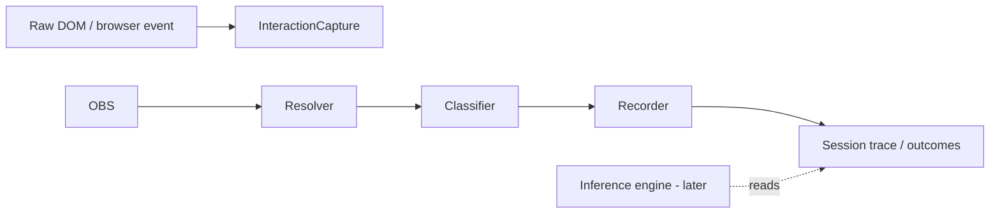

# DESIGN — Interaction monitoring (classifier foundation)

**Vocabulary:** **Observation** (Tier-1) = system runs an extract on the page.
**Interaction** (this doc) = the user did something on the page; we capture,
resolve, and classify it against substrate.

**Status:** Design lock for v1 foundation. **Inference is out of scope here**
(belief, entropy, workflow triggers → `DESIGN_user_intent_inference.md`, Phase C).
**Date:** 2026-05-26
**Relates to:** `DESIGN_perspective_centric_flow.md`, `DESIGN_substrate_constrains_agent.md`,
`GROUND_SPEC.md`, `PAGEMODEL_SPEC.md`, `OUTCOMES_SPEC.md`, `DESIGN_llm_roles.md`,
`Services/PerspectivePredicates.js`, `Services/LandmarkResolver.js`,
`Services/PageClassifier.js` (different problem — precondition failures, not interactions).

---

## 1. Purpose

Build a **deterministic, auditable pipeline** that:

1. **Captures** user interactions on monitored pages (with consent).
2. **Resolves** each interaction to substrate where possible (landmark UID, role,
   Perspective membership).
3. **Classifies** each interaction into a **bounded, structured record** suitable
   for logging, UI, training, and **later** inference.

The classifier answers: **“What happened, on what substrate referent, with what
labels?”** — not **“What is the user trying to accomplish?”** (that is inference).



---

## 2. Non-goals (v1 classifier)

| Out of scope | Belongs in |
|--------------|------------|
| Belief distribution over Perspectives | Inference (Phase C) |
| Entropy / confidence thresholds | Inference |
| `CapabilityAPI.invoke` triggers | Inference + policy |
| LLM per user event on hot path | Optional residual classifier (v2) |
| Pre-authored Activity pattern matching | Rejected framing |
| Monitoring Orchard UI (Studio/chat) | Surface affordance events (separate) |
| Password field values, clipboard content | Privacy — emit interaction without payload |

---

## 3. Layer model

Four layers, strict boundaries. **Only layer 3 is “the classifier”** in the narrow
sense; layers 1–2 are prerequisites, layer 4 is persistence.

| Layer | Module (proposed) | Output |
|-------|-------------------|--------|
| **L0 Capture** | Content script + background coordinator (`InteractionCapture`) | `RawInteraction` |
| **L1 Resolver** | `InteractionResolver` (new) | `ResolvedInteraction` |
| **L2 Classifier** | `InteractionClassifier` (new, pure) | `ClassifiedInteraction` |
| **L3 Recorder** | `InteractionTrace` (new) + outcomes adapter | append-only trace |

**Rule:** L2 is a **pure function** `(ResolvedInteraction, Context) → ClassifiedInteraction`.
No DOM, no `chrome.*`, no LLM — testable in node like `Core/outcomes.js`.

---

## 4. Interaction capture (L0)

### 4.1 Event kinds (medium grain)

Map DOM/browser signals to a **small interaction vocabulary** (not full DOM fidelity).

| `interactionKind` | Source | Notes |
|-------------------|--------|-------|
| `click` | click / auxclick | Primary button default |
| `dblclick` | dblclick | |
| `type` | input (debounced) | Coalesce keystrokes; no password values |
| `submit` | submit on form | |
| `focus` | focusin | Landmark-scoped only |
| `blur` | focusout | Optional v1 |
| `scroll-into` | IntersectionObserver on landmark | Not every scroll pixel |
| `navigate` | webNavigation / SPA hooks | Tab URL change; not every mousemove |
| `tab-activate` | tabs.onActivated | Browser-level context |

**Filtered out at L0:** `mousemove`, `pointermove`, high-frequency `scroll` on
`document`, events on unmonitored elements when demand-driven wiring is active.

### 4.2 `RawInteraction`

```typescript
type RawInteraction = {
  id: string;              // evt_* 
  ts: number;
  tabId: number;
  frameId: number;
  url: string;             // canonicalized at background

  interactionKind: string; // table above

  // Target (always present for DOM-derived)
  target: {
    tagName: string;
    id?: string;
    classList?: string[];  // capped
    role?: string;         // a11y role if cheap
    accessibleName?: string; // truncated
  };

  // Kind-specific (optional)
  click?: { button: number; clientX: number; clientY: number; modifiers: string[] };
  type?: { inputType?: string; lengthDelta?: number };  // NOT raw value for sensitive fields
  navigate?: { fromUrl?: string; toUrl: string; transitionType?: string };
};
```

Emitted: content script → background (`INTERACTION_RAW` message). Background
assigns `id`, `url`, enqueues for L1.

### 4.3 Demand-driven capture

Listeners attach only for landmarks in the **interaction demand set**:

```typescript
type InteractionDemand = {
  groundId: string;
  landmarkUid: string;
  interactionKinds: string[];  // e.g. ['click','type']
  reason: 'accepted-perspective' | 'explicit-opt-in' | 'debug';
};
```

**v1 demand sources:**

- All landmarks in **accepted** Perspectives on this Ground (when **Track** consent on).
- Explicit debug flag in Studio (engineering).

**Not v1:** dynamic demand from inference matchers (inference not built).

---

## 5. Resolution (L1)

Reverse map: `event.target` → zero or more `{ landmarkUid, perspectiveId, role }`.

### 5.1 Resolution statuses

| `resolutionStatus` | Meaning |
|--------------------|---------|
| `hit` | Exactly one landmark match under active demand set |
| `ambiguous` | Multiple landmark UIDs match (report all) |
| `miss` | No landmark; target not in demand set or selector mismatch |
| `suppressed` | Sensitive field / policy block |

### 5.2 `ResolvedInteraction`

```typescript
type ResolvedInteraction = {
  raw: RawInteraction;

  groundId: string | null;     // GroundMatcher on url
  resolutionStatus: 'hit' | 'ambiguous' | 'miss' | 'suppressed';

  matches: Array<{
    landmarkUid: string;
    perspectiveId: string;
    role?: string;             // from Perspective composition node
    selectorUsed: string;      // which selector matched
    confidence: number;        // 0–1 structural (not intent)
  }>;

  activePerspectiveIds: string[];  // predicate-active at ts (listActivePerspectives)
};
```

### 5.3 Resolver algorithm (v1, deterministic)

For each `InteractionDemand` on this tab’s Ground:

1. Load landmark record (selector, frameUrl).
2. Test `event.target` against selector (content script or background round-trip).
3. If multiple demands hit, status = `ambiguous`.

**Reuse:** `LandmarkResolver` (forward), content-script `resolveElement`, frame
routing from predicate eval, `listActivePerspectives` for context — **new** reverse
hit-test API (`RESOLVE_INTERACTION_TARGET`).

**Performance:** Bounded by |demand set| per tab, not |all DOM nodes|.

---

## 6. Classification (L2) — core model

**Normative implementation (C0):** `SPEC_INTERACTION_CLASSIFIER_C0.md`,
`Core/interactionClassification.js`.

Classification assigns **bounded labels** from substrate context. No LLM on hot path.

### 6.1 `ClassifiedInteraction`

```typescript
type ClassifiedInteraction = {
  id: string;
  ts: number;
  tabId: number;
  groundId: string | null;

  // From raw + resolver
  interactionKind: string;
  resolutionStatus: string;
  matches: ResolvedInteraction['matches'];
  activePerspectiveIds: string[];

  // Classifier output — bounded vocabulary
  classification: InteractionClassification;
};

type InteractionClassification = {
  // Primary — always populated
  tier: 'substrate' | 'browser' | 'unresolved';

  // When tier === 'substrate' (≥1 match)
  primary?: {
    landmarkUid: string;
    perspectiveId: string;
    role?: string;
    semanticVerb: SemanticVerb;   // see §6.2
  };

  // When ambiguous — ranked candidates, same shape
  candidates?: Array<{
    landmarkUid: string;
    perspectiveId: string;
    role?: string;
    semanticVerb: SemanticVerb;
    score: number;                // deterministic tie-break
  }>;

  // When tier === 'browser'
  browserContext?: 'navigate' | 'tab-switch';

  // When tier === 'unresolved'
  unresolvedReason?: 'miss' | 'suppressed' | 'no-ground' | 'no-demand';

  // Optional enrichments (deterministic)
  page?: {
    archetypeId?: string;         // from siteMap node for url
    activePredicateSummary?: string; // e.g. "2 perspectives active"
  };
};
```

### 6.2 `SemanticVerb` (medium grain)

Compose **interactionKind × landmark role × Perspective name** into a stable verb
enum for analytics and future inference features — **not** free-text activity.

**Base verbs from interaction:**

`click` | `type` | `submit` | `focus` | `scroll-into-view` | `navigate` | `switch-tab`

**Refined verbs when role known (examples):**

| role (Layer 2) | interactionKind | `semanticVerb` |
|----------------|-----------------|----------------|
| `search-query` | type | `enter-search-query` |
| `search-submit` | click | `submit-search` |
| `primary-action` | click | `activate-primary-action` |
| `result-link` | click | `select-result` |
| `navigation-link` | click | `follow-link` |

**Rule:** If role missing, fall back to base verb. If role present, use composed
verb from a **small authored table** (Ground- or global-default), extensible per
PageModel later — not LLM-generated per event.

```typescript
// Pure helper — lives in Core/interactionClassification.js
function semanticVerb(interactionKind: string, role?: string): SemanticVerb;
```

### 6.3 Classifier rules (v1)

```
if resolutionStatus === 'suppressed' → tier unresolved, reason suppressed
if groundId == null               → tier unresolved, reason no-ground
if resolutionStatus === 'miss'      → tier unresolved, reason miss
if resolutionStatus === 'ambiguous' → tier substrate, candidates[] with scores
if resolutionStatus === 'hit'       → tier substrate, primary from best match
if interactionKind === 'navigate'   → tier browser (even without landmark)
```

**Scoring for ambiguous (deterministic):**

- Prefer match whose `perspectiveId` ∈ `activePerspectiveIds`.
- Prefer tighter selector specificity (id > role+name > positional).
- Prefer most recently interacted Perspective in session (tie-break).

### 6.4 Judge axis (aligns with `DESIGN_llm_roles`)

| Stage | Judge | Feedback |
|-------|-------|----------|
| L0 capture | Schema valid | Drop malformed |
| L1 resolve | Deterministic hit test | Resolver telemetry |
| L2 classify | Deterministic rules | Unit tests + golden traces |
| User correction (later) | User | `classification-corrected` outcome |

**Optional v2:** LLM **classify** role only for residual `ambiguous` rows — same
pattern as `adjudicateStructure`, not hot path.

---

## 7. Recording (L3)

### 7.1 Session trace

Append-only, tab- or session-scoped:

```typescript
type InteractionTrace = {
  sessionId: string;
  groundId?: string;
  events: ClassifiedInteraction[];  // ring buffer e.g. 500
  stats: {
    total: number;
    substrateHits: number;
    missRate: number;
  };
};
```

Storage: `runtime/sessions/<sessionId>/interactions.jsonl` (partition-aligned) or
chrome.storage session key for v1 prototype.

**Separate from** `GroundEventBus` (substrate health: resolution-degraded,
effect-drift). Interaction trace is **behavior**, not landmark lifecycle.

### 7.2 Outcomes stream adapter

Extend `Core/outcomes.js`:

```typescript
// New op value
OPS += 'user-interaction'

makeEvent({
  phase: 'runtime',
  op: 'user-interaction',
  groundId,
  perspectiveId: classification.primary?.perspectiveId,
  featureId: classification.primary?.landmarkUid,
  role: classification.primary?.role,
  detail: {
    interactionKind,
    semanticVerb,
    resolutionStatus,
    classificationTier: classification.tier,
  },
});
```

Enables training and Studio/debug views without building inference.

---

## 8. Consent and wiring

| Tier | Allows |
|------|--------|
| **Track** (classifier v1) | L0–L3 on permitted hosts |
| **Interpret** (later) | Read trace + belief engine |
| **Act** (later) | Workflows |

Classifier implementation ships under **Track** only.

---

## 9. Context object (L2 input)

```typescript
type ClassificationContext = {
  groundId: string | null;
  siteMapNode?: { archetypeId: string; urlPattern: string };
  activePerspectiveIds: string[];
  acceptedPerspectiveIds: string[];  // library on this ground — for scoring only in v1
  recentEvents: ClassifiedInteraction[]; // last N for tie-break — optional v1
};
```

**Note:** `acceptedPerspectiveIds` affects **disambiguation scoring**, not labels
for unaccepted Perspectives — do not classify interactions as “in” a Perspective
the user never accepted unless it appears in `matches` structurally.

---

## 10. Relationship to inference (later)

| Classifier (this doc) | Inference (later) |
|----------------------|-------------------|
| Per-event structured record | Distribution over accepted `perspectiveId` |
| `semanticVerb` + landmark hit | P(active Perspective) |
| Append-only trace | Threshold → trigger |
| Deterministic, &lt;50ms target | Hot belief + periodic LLM |

**Contract:** Inference engine **subscribes** to `ClassifiedInteraction` stream; never
re-parses raw DOM. If inference is wrong, correct **interpretation**, not rewrite
history of classified events (correction = new outcome event).

---

## 11. Implementation slices

| Slice | Deliverable |
|-------|-------------|
| **C0** | `SPEC_INTERACTION_CLASSIFIER_C0.md` + `Core/interactionClassification.js` + `node --test` |
| **C1** | `InteractionDemand` registry in background; demand from accepted Perspectives |
| **C2** | Content-script listeners (click, input debounced, submit, focus) → `INTERACTION_RAW` |
| **C3** | `RESOLVE_INTERACTION_TARGET` in content script + L1 resolver |
| **C4** | Background pipeline RAW → RESOLVED → CLASSIFIED → trace append |
| **C5** | Outcomes `op: 'user-interaction'` wiring + Studio/debug trace viewer |
| **C6** | Consent gate in extension settings |

**Not in classifier slices:** belief state, interpretation events, Workflow scheduler.

### 11.1 Reuse map

| Existing | Use |
|----------|-----|
| `PerspectivePredicates.listActivePerspectives` | `activePerspectiveIds` in context |
| `GroundMatcher` | `groundId` on url |
| `LandmarkResolver` / registry | Forward selector load for reverse test |
| `Core/outcomes.makeEvent` | Recording |
| `classifyEffectDrift` pattern | Separate concern — engine actions only |

| New | Use |
|-----|-----|
| `InteractionClassifier` | L2 pure |
| `InteractionResolver` | L1 |
| `InteractionCapture` | L0 coordination |

**Do not overload** `PageClassifier.js` — different domain (precondition failures).

---

## 12. Open decisions

1. **Tab-scoped vs session-scoped trace** when user switches tabs on same Ground.
2. **iframe events** — v1 top-frame + known iframeContexts only?
3. **Shadow DOM** — v1 best-effort composed path or miss?
4. **Navigate without landmark** — always `tier: browser` or also emit page archetype?
5. **Maximum demand set size** before sampling (perf guard).

---

## 13. Document map

| Question | Read |
|----------|------|
| What is classified per event? | §6 `ClassifiedInteraction` |
| What is NOT inference? | §2, §10 |
| Pipeline layers | §3 |
| Product story (intent-only user) | `DESIGN_perspective_centric_flow.md` |
| Future belief / triggers | `DESIGN_user_intent_inference.md` |
