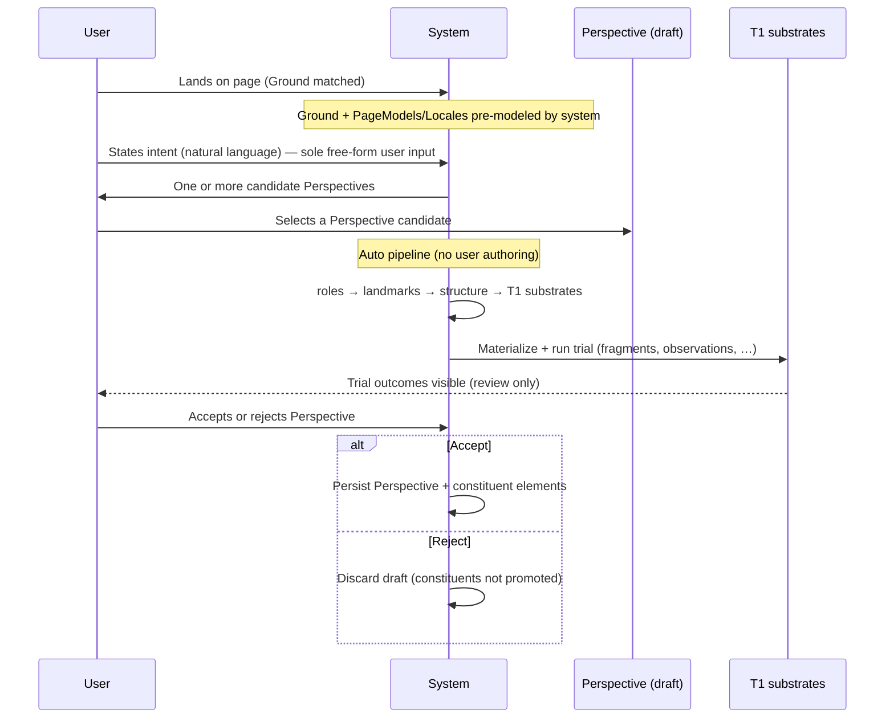

# DESIGN — Perspective-centric product flow and inference

**Status:** Product design lock (full-app target). Supersedes the implicit model
“user authors all substrate.” **User input in this flow is intent only** (plus
discrete choices: which Perspective candidate, accept/reject). All downstream
substrate is **system-generated**. Implementation today is **partial** and still
reflects legacy manual capture (pick / resolve) — not the target loop.
**Date:** 2026-05-26
**Relates to:** `DESIGN_substrate_constrains_agent.md` (thesis, revised § 2),
`DESIGN_interaction_monitoring.md` (track → classify — **build before inference**),
`DESIGN_user_intent_inference.md` (runtime belief/triggers — later),
`GROUND_SPEC.md`, `PAGEMODEL_SPEC.md`, `DESIGN_llm_roles.md`,
`Sidepanel/modes/perspective-capture.js`, `AnthropicService.proposePerspectives`.

---

## 1. User story (canonical)



**In prose:**

1. User reaches a page. **Ground** is matched; **PageModels (Locales)** for that
   archetype already exist — **system-owned**, not user-authored in this flow.
2. User provides **intent** (what they want to do here).
3. System presents **one or more candidate Perspectives** (purpose-scoped views
   over the page model).
4. User **selects** one candidate (discrete choice — not silent inference).
5. System runs an **auto-materialization pipeline** on that candidate (user does
   **not** pick elements, resolve roles, or author fragments by hand):
   - bind **roles** → **landmarks** (resolve/locate against PageModel + live DOM),
   - derive **structure** (Layer 2 composition, groupings/sequences as proposed),
   - synthesize and **run Tier-1 substrates** (fragments, observations, …) as proof.
6. User **reviews trial outcomes** and **accepts or rejects** the Perspective.
7. **Accept** → persist Perspective + all generated constituents. **Reject** →
   discard draft; do not promote ephemeral materializations.

**User input boundary (full app):**

| User provides | System generates |
|---------------|------------------|
| Intent (NL) | Perspective candidates (Phase A) |
| Select one candidate | Roles → landmarks → structure → T1 trial bundle (Phase B) |
| Accept / reject | Nothing (verdict only) |

**User acknowledgment boundary:** The only substrate class the user
**acknowledges** is **Perspective** (via accept). Landmarks, fragments, and
observations are **system outputs** the user judges holistically at accept/reject —
not separate authoring surfaces in this flow.

**System-pre-modeled (before user intent):** Ground, PageModel/Locale, siteMap,
Features, conventions.

---

## 2. Ownership table

| Artifact | Owner in full app | User sees / judges |
|----------|-------------------|-------------------|
| Ground, chrome, siteMap, conventions | System (Explore / discovery) | Indirectly via proposals |
| PageModel / Locale (Features, Layers, Goals) | System per archetype | Via proposal context |
| **Perspective** (intent, roles, predicates, composition) | **User selects candidate + accept** | **Primary** |
| Landmarks (UID registry) | **Auto-generated** in pipeline; persisted on accept | Trial review only |
| Fragments, Observations, Analyses | **Auto-generated** + run in trial; persisted on accept | Trial outcomes → accept/reject |
| Workflows / Strategies | May attach later; not in core story | Optional |

Implication: Orchard is not “an IDE for landmarks.” It is **intent → choose
Perspective → system builds bundle → accept/reject** — the user is a **reviewer**,
not a substrate author. (Legacy Studio/sidepanel manual authoring may remain for
power users but is **out of scope** for this product story.)

---

## 3. Inference defined from this story

“Inference” is not one module. The story defines **three inference phases** with
different inputs, hypothesis sets, judges, and outputs.

### 3.1 Phase A — Intent → Perspective candidates (authoring-time)

| | |
|--|--|
| **When** | User has stated intent; tab on a Ground with a PageModel for this archetype |
| **Input** | User intent text, URL, PageModel/Locale catalog, optional screenshot / sibling Perspectives |
| **Hypothesis set** | **Candidate Perspectives** (2–N options): name, role checklist, predicates, rationale |
| **Mechanism** | LLM **propose** (`proposePerspectives`) + deterministic sanitization |
| **Judge** | **User selection** — which option to pursue (strongest signal in the whole flow) |
| **Output** | Draft Perspective bound to intent |

This is **discrete inference**: rank/literal proposal, not a running distribution.
Ambiguity ends when the user picks one card.

**Already aligned in code:** `proposePerspectives`, perspective-capture baseline/enhanced arms, `onPage` / downstream tagging.

**Not inference:** User did not author PageModel; system constrained the proposal space to what the site archetype supports.

---

### 3.2 Phase B — Auto-materialization + trial (system-built bundle)

| | |
|--|--|
| **When** | Immediately after user selects a Perspective candidate |
| **Input** | Selected candidate (role list, predicates), user intent, PageModel, live tab |
| **Hypothesis** | “This Perspective **applies** and **executes** the user’s intent on this page” |
| **Mechanism** | **Automated pipeline** (LLM + deterministic verify), in order: |
| | 1. **Roles → landmarks** — `resolveRoles` / locate / verify (no user pick) |
| | 2. **Structure** — `proposePerspectiveStructure` (or equivalent) over resolved UIDs |
| | 3. **T1 synthesis** — generate fragments/observations (and related) from intent + roles |
| | 4. **Trial run** — execute bundle; predicate check; effect observation on steps |
| **Judge** | **Trial outcomes** + **user accept/reject** (only human step after select) |
| **Output** | Complete bundle + `trialTrace`; or reject → discard ephemerals |

This phase is **automated hypothesis testing**. The user does not labor inside
capture UI; they **wait, review, and verdict**.

| Signal | Meaning |
|--------|---------|
| Resolve verified | Auto-bound role → element |
| Fragment/Observation success | Generated ops support intent |
| Predicate active | Applicability holds |
| User reject | Bundle failed user trust (any auto step may be root cause) |

**Training:** accept/reject + per-step outcomes + per-stage auto outputs (resolve,
structure, plan) → outcomes stream.

**Gap vs story today:** Pipeline is **staged manually** in perspective-capture
(pick, resolve buttons). Target is **one-shot orchestration** after select.

---

### 3.3 Phase C — Session → active acknowledged Perspective (runtime)

| | |
|--|--|
| **When** | User browsing with **Interpret** consent; at least one **accepted** Perspective on this Ground |
| **Input** | Resolved user evidence (landmark interactions), predicate transitions, navigation, optional fresh intent utterance |
| **Hypothesis set** | **Only accepted Perspectives** on this Ground (small library), not all site activities |
| **Mechanism** | Hot local belief over `{ perspectiveId, confidence }`; warm LLM elaboration optional |
| **Judge** | Policy (autonomy class + thresholds) + user correction |
| **Output** | `BeliefSnapshot`; optional `TriggerProposal` → `CapabilityAPI.invoke` |

This is the **entropy-gradient** agent from `DESIGN_user_intent_inference.md`,
but the constraint surface changed:

```
Runtime hypotheses ⊆ { accepted Perspectives on Ground G }
Structural priors  ← PageModel/Locale (system) + Perspective composition (user-accepted)
Coverage           ← evidence resolves to landmarks in active candidate Perspective(s)
```

**Critical distinction from old framing:**

| Old | New (this story) |
|-----|------------------|
| User maintains full substrate | User maintains **Perspective library** |
| “What is user doing on amazon.com?” | “**Which of my accepted Perspectives** am I in (or approaching)?” |
| Open vocabulary from all Locales | Closed-ish set: **saved Perspectives** + system PageModel bounds |

Unmodeled behavior: user acts outside any accepted Perspective → **abstain** or
prompt to run Phase A again (new intent → new Perspective), not site-wide guessing.

---

## 4. Revised thesis (one paragraph)

**System pre-models the territory (Ground, PageModel). The user acknowledges only
Perspectives. At authoring time, inference proposes Perspectives from intent; the
user selects; verification materializes landmarks and runs T1 substrates as proof;
accept persists the bundle. At runtime, inference estimates which accepted
Perspective is active and may trigger deterministic operations bound to that
bundle — abstaining when evidence falls outside acknowledged Perspectives.**

See `DESIGN_substrate_constrains_agent.md` § 1b for the formal qualified claim.

---

## 5. Mapping story steps → `DESIGN_llm_roles` judges

| Story step | Primary role | Judge |
|------------|--------------|-------|
| Intent → candidates | **propose** | User picks option |
| Resolve roles / selectors | **resolve** | Deterministic verify (+ human pick) |
| Derive descriptions | **describe** | Staleness / override |
| Trial fragments/observations | **plan** / execution | Step outcomes |
| Accept / reject Perspective | **propose** (verdict) | **userJudgment** |
| Runtime belief update | **classify** | Threshold policy + correction |
| Runtime elaboration | **describe** | User-readable only |

---

## 6. What runtime inference does *not* need (given this story)

- Guessing activities the user never acknowledged (no saved Perspective).
- Competing with full-site macro semantics on unmodeled clicks.
- Treating PageModel as user intent — PageModel bounds automation; user intent is
  the **utterance** plus **accepted Perspective**.
- Manual landmark/fragment authoring on the critical path (auto pipeline only).

---

## 7. Constituent materialization (accept semantics)

On **accept**, persist atomically (logical unit):

```typescript
type PerspectiveAcceptance = {
  perspective: PerspectiveRecord;   // intent, predicates, composition, metadata
  landmarks: LandmarkRecord[];      // validated UIDs + selectors + effects
  constituents: {
    fragments?: FragmentRecord[];
    observations?: ObservationRecord[];
    // analyses, etc. as product expands
  };
  trialTrace: OutcomeEvent[];       // proof run — links to OUTCOMES_SPEC
  acceptedAt: number;
  userIntent: string;               // seed at proposal time
};
```

On **reject**: drop draft Perspective and **do not promote** trial-only
landmarks/constituents (or mark as ephemeral in session store only).

**Inference dependency:** Runtime Phase C only considers Perspectives present in
`PerspectiveAcceptance` history for this Ground (plus predicate-active filter).

---

## 8. Implementation alignment (honest)

**Do not confuse “built primitives” with “built product loop.”** Many steps exist
as **manual authoring tools**; the target is **orchestrated automation** after
intent + select.

| Story step (target) | Today |
|---------------------|-------|
| Ground + PageModel pre-modeled | **Partial** — Explore / discovery |
| User provides intent only | **Partial** — intent seeds propose; capture still exposes manual substrate UI |
| System proposes Perspectives | **Built** — `proposePerspectives` |
| User selects candidate | **Built** — choose option |
| Auto: roles → landmarks → structure | **Partial** — `resolveRoles`, `proposePerspectiveStructure` exist but are **button-driven**, not pipeline |
| Auto: T1 synthesize + run trial | **Not built** as one orchestrated step |
| User accept / reject only | **Partial** — Save ≈ accept without required trial; no hard reject discard |
| Runtime Phase C | **Not built** |

**Legacy mismatch:** `perspective-capture.js` is an **expert authoring surface**;
the full-app story is a **review surface** after automation.

---

## 9. Open product decisions

1. **Multi-Perspective active** — Can two **accepted** Perspectives be active
   simultaneously on one tab? (Mixture belief vs forced disambiguation.)
2. **Re-trial** — Edit accepted Perspective → new Phase B without new Phase A?
3. **Downstream pages** — Proposal includes `onPage: false` options; story needs
   “navigate then validate” without breaking acknowledge boundary.
4. **Intent persistence** — Is session intent stored on Perspective, Ground, or
   Path layer when Path/Intent ships?

---

## 10. Document map

| Question | Read |
|----------|------|
| User story + three inference phases | This doc |
| Qualified thesis + abstain rules | `DESIGN_substrate_constrains_agent.md` |
| Events, thresholds, buses | `DESIGN_user_intent_inference.md` |
| Entity hierarchy | `GROUND_SPEC.md` |
