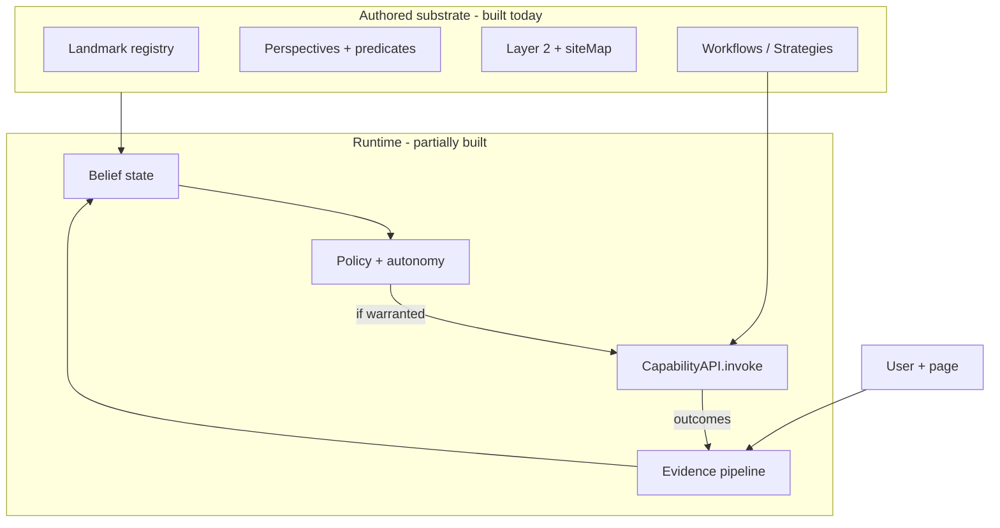

# DESIGN — Substrate constrains a probabilistic agent (defensible thesis)

**Status:** Foundational design lock. **Product flow:** only **Perspective** is
user-acknowledged; see `DESIGN_perspective_centric_flow.md`. Implementation detail:
`DESIGN_user_intent_inference.md`; build status **substrate-heavy, inference-absent**
(2026-05-26).
**Date:** 2026-05-26 (rev. perspective-centric)
**Relates to:** `DESIGN_perspective_centric_flow.md`, `GROUND_SPEC.md`,
`PAGEMODEL_SPEC.md`, `OUTCOMES_SPEC.md`, `DESIGN_llm_roles.md`,
`DESIGN_user_action_classifier.md` (foundation),
`DESIGN_user_intent_inference.md` (later).

---

## 1. Thesis (qualified claim)

### 1a. Runtime (Phase C — session)

**Where the user has accepted one or more Perspectives on a Ground, and has
authorized inference, Orchard may estimate which acknowledged Perspective is
active (or approaching) from resolved evidence — and at configured confidence
and autonomy, invoke deterministic operations bundled with that Perspective.**

### 1b. Full product (authoring + runtime)

**System pre-models the site (Ground, PageModel/Locale). The user acknowledges
only Perspectives. Inference at authoring maps **stated intent → candidate
Perspectives**; the user **selects**; verification **materializes landmarks and
runs T1 substrates** as proof; **accept** persists the Perspective and
constituents. Runtime inference maps **live evidence → active accepted
Perspective**; actuators run inside that bundle.**

Equivalently:

> **System bounds the territory; user bounds intent via acknowledged
> Perspectives; inference operates in the intersection; execution stays
> deterministic and auditable.**

The thesis is **not** “read intent from the web,” “user authors every landmark,”
or “LLM on every DOM event.”

It **is**: (1) propose-and-select at authoring, (2) verify-then-accept as the
trust gate, (3) session belief only over **saved** Perspectives, with abstention
elsewhere.

---

## 2. Definitions

| Term | Meaning in this codebase |
|------|---------------------------|
| **System substrate** | Ground, PageModel/Locale (Features, Goals), siteMap, conventions — **pre-modeled by system**, not user-acknowledged in the product story. |
| **User-acknowledged substrate** | **Accepted Perspectives** and their **constituents** (landmarks, fragments, observations, …) persisted on accept. |
| **Substrate (combined)** | System substrate ∪ user-acknowledged bundle. Runtime Phase C hypotheses draw from **accepted Perspectives only**; Phase A proposals draw from **PageModel + intent**. |
| **Constraint** | Anything that removes hypotheses or attaches stable identity to evidence. **Primary user constraint:** the library of accepted Perspectives. **Primary system constraint:** PageModel/Locale for the active archetype. |
| **Probabilistic agent** | Runtime component that updates a **session-scoped belief state** over a **finite, named hypothesis set** derived from constraints. It does not execute DOM actions directly. |
| **Deterministic actuator** | Workflow / Strategy / Fragment execution via `CapabilityAPI` — replayable steps with explicit failure modes. |
| **Evidence** | Observations the agent may condition on: resolved user interactions on landmarks, predicate transitions, navigation, engine-observed effect outcomes, optional user corrections. |
| **Coverage** | Fraction of user interactions that **reverse-resolve** to at least one landmark in an **active** Perspective on the current Ground. |
| **Substrate health** | Aggregate trust in structure (selector verify pass rate, effect drift, resolution degradation). Low health **down-weights** structural priors. |

**Naming (implementation):** Conversation “Locale” often means **Perspective**
(active perspective set, landmark roles). **PageModel / Locale** in `GROUND_SPEC`
is the archetype catalog — constraints for inference come from **both**, composed
on read.

---

## 3. When the thesis holds (preconditions)

### 3a. Authoring (Phase A + B — `DESIGN_perspective_centric_flow.md`)

1. Ground matched; PageModel exists for archetype (system).
2. User stated intent; system proposed ≥1 Perspective; **user selected** one.
3. Phase B trial completed (landmarks validated, T1 constituents run).
4. User **accepted** — bundle persisted. (Reject → no runtime hypothesis.)

### 3b. Runtime (Phase C)

1. **Authorization** — observe → infer → trigger tiers (§ 8).
2. **Ground match** — `GroundMatcher`.
3. **≥1 accepted Perspective** on this Ground for the user.
4. **Resolvable evidence** — interaction maps to a landmark in an active
   candidate Perspective, or **unmodeled policy** (§ 5.3): abstain or suggest
   new Perspective flow — not site-wide guess.
5. **Mixture discipline** — multiple accepted actives handled explicitly.
6. **Substrate trust** — health down-weights stale constituents.
7. **Actuator authorization** — operation bound to Perspective bundle; autonomy
   class permits trigger.

If preconditions fail: **abstain**, or route to **intent → propose Perspective**
(Phase A), not silent automation.

---

## 4. Two components and the interface between them



| Component | Responsibility | Must not |
|-----------|----------------|----------|
| **Substrate (authored)** | Stable IDs, perspectives, priors, actuator definitions | Run probabilistic logic; mutate without user review |
| **Inference (runtime)** | Update beliefs; propose trigger; surface transparency | Click/type/navigate directly; bypass consent |
| **Actuators (deterministic)** | Execute authorized operations reliably | Infer intent; widen hypothesis space |

**Interface contract (normative):**

```typescript
// Belief output — not a command
type BeliefSnapshot = {
  groundId: string;
  hypotheses: Array<{ label: string; probability: number; sources: string[] }>;
  coverage: number;           // 0–1 resolved evidence fraction (session window)
  substrateTrust: number;     // 0–1 from health rollups
  topLabel: string | null;
  confidence: number;           // top-1 probability, calibrated
  ambiguous: boolean;           // e.g. top-2 within ε
};

// Trigger proposal — policy decides acceptance
type TriggerProposal = {
  belief: BeliefSnapshot;
  workflowId: string;
  autonomyClass: 'suggest' | 'prepare' | 'execute' | 'execute-confirm';
  reason: string;               // human-readable, substrate-linked
};
```

Downstream code **accepts or rejects** proposals; belief alone never executes.

---

## 5. What substrate actually provides (and does not)

### 5.1 Provides — constraint geometry

| Substrate artifact | Constraint role |
|------------------|-----------------|
| Canonical `lmk_*` UID | Same referent across time/users for evidence attachment |
| Perspective predicates | **Bounds** which landmarks are in play (active set) |
| Perspective name / description | **Coarse hypothesis labels** (site-facing, not goal-facing) |
| Landmark `role`, Layer 2 edges | **Transition priors** (what often follows what) |
| siteMap `pathsTo` | **Cross-page flow priors** (archetype graph) |
| Effect annotations | **Testable predictions** on actions (confirm/disconfirm belief) |
| Authored Workflows | **Allowed actions** when policy fires |

Substrate turns opaque DOM into a **low-dimensional, named feature vector** —
the prerequisite for fast local inference.

### 5.2 Does not provide — common overclaims

| Overclaim | Reality |
|-----------|---------|
| “Substrate IS vocabulary” | Substrate supplies **candidate labels and features**; user goals often need **Intent, tags, or history** |
| “Every click is meaningful” | **Coverage** is partial; unmodeled clicks are normal |
| “Layer 2 sequences = user behavior” | Sequences are **author hypotheses** until validated by outcomes |
| “Effect annotation = truth” | Annotations are **heuristic**; drift is expected (`landmark-effect-drift`) |
| “Active Perspective = user intent” | Multiple actives → **ambiguity**, not clarity |
| “siteMap = ground truth” | Graph is **discovered/incomplete**; SPAs and experiments break edges |

### 5.3 Unmodeled interaction policy (required)

When evidence does not resolve to substrate:

- **Do not** invent a landmark or inflate confidence.
- **Do** record `resolution: 'none'` in session trace.
- **Do** widen belief or hold prior; optional low-cost behaviors only
  (`autonomyClass: 'suggest'` with generic copy).
- **Do** treat sustained low coverage as a signal to **author more substrate**,
  not to bypass substrate with raw selectors.

---

## 6. Inference: defensible scope

### 6.1 Hypothesis set

Hypotheses are **finite and named**, composed from:

1. **Primary:** active Perspective id/name (site-scoped activity).
2. **Refinement:** landmark role + last action kind (CLICK, TYPE, …).
3. **Flow:** optional siteMap position (`step-k-of-n` on a path).
4. **Overlay:** user tags / stated Intent when present.

The LLM may **elaborate** in natural language (warm path) for transparency and
training; **matchers and triggers bind to structured fields**, not free prose.

### 6.2 Belief update — layered, not monolithic

| Layer | Role | Latency |
|-------|------|---------|
| **Hot** | Feature update + belief revision + policy check | Target &lt;50ms per resolved evidence |
| **Warm** | LLM refine labels, propose new tags, explain “why” | Periodic / on pause; not per mousemove |
| **Cold** | Retrain weights, population priors (consent), calibration | Offline |

**Entropy / confidence** are implementation metrics; **authors and users see
confidence and plain-language reason**, not Shannon entropy.

### 6.3 Emergent recognition without Activity primitives

Recognition is **not** template matching against pre-authored Activity records.
It is **posterior concentration** as evidence accumulates under constraints.

Falsifiable statement: *given two sessions with identical resolved evidence
sequences and identical active substrate, belief snapshots should be
reproducible on the hot path* (LLM warm path may differ in wording only).

---

## 7. Actuation: autonomy, not automation

Confidence thresholds are **necessary but not sufficient**. Each Workflow
declares an **autonomy class**:

| Class | Behavior | Typical confidence bar |
|-------|----------|------------------------|
| `suggest` | UI hint only; no side effects | Moderate |
| `prepare` | Prefetch, cache; reversible waste if wrong | Moderate–high |
| `execute` | Runs operation; reversible | High |
| `execute-confirm` | High-stakes; user confirm | Very high |

**Anticipatory** value (before commit) is allowed only for `suggest` / `prepare`
by default. Irreversible `execute` defaults to **post-commit or confirm**.

Misinterpretation cost is a **product** parameter, not an afterthought.

---

## 8. Consent, transparency, and trust boundaries

Inference is a **stronger** claim than logging DOM events. Defensible minimum:

| Tier | User understands | System may |
|------|------------------|------------|
| Observe | “Extension sees my interactions on allowed sites” | Capture + resolve evidence |
| Infer | “Extension estimates what I’m doing” | Maintain `BeliefSnapshot` |
| Trigger | “Extension may start workflows on that estimate” | `CapabilityAPI.invoke` |
| Share | “Anonymized patterns improve models” | Cold-path aggregation |

**Transparency:** current top hypothesis, confidence, contributing substrate
fields, pause/disable, one-click correction (“actually: …”) feeding cold path.

**Local-first default:** belief + evidence stay on device; cloud is opt-in
enhancement for warm/cold paths.

---

## 9. Substrate health and coverage as first-class inputs

Belief must condition on **trust**, not only structure:

```
effectivePrior = structuralPrior × substrateTrust × coverageWeight
```

| Signal (exists or planned today) | Use |
|----------------------------------|-----|
| `landmark-resolution-degraded` / `failed` | ↓ trust for involved UIDs |
| `landmark-effect-drift` | ↓ weight on effect-based updates |
| Outcomes stream resolve pass rate | Ground-level conventions + trust |
| Session coverage rolling average | ↓ trigger appetite when low |

**Defensible corollary:** *bad substrate produces quiet agents, not confident wrong
agents.*

---

## 10. Relationship to deterministic execution (today)

**Built:** substrate authoring, landmark resolution for **engine** steps, effect
observation on selected engine actions, active Perspective evaluation,
siteMap/workflows as journey **drafts**, `CapabilityAPI` invocation, outcomes
stream (partial wiring).

**Not built:** reverse resolution for user events, session belief state, trigger
scheduler, interpretation events, consent tiers for inference, autonomy classes on
workflows.

The thesis describes **why** the built work matters, not **that** the agent
already exists. v1 product value remains **reliable execution**; inference is an
**enabled future** that must not compromise replayability.

---

## 11. Non-goals (explicit)

- Replacing user judgment with silent autonomy on unmodeled pages.
- Competing with macro recorders on raw event fidelity.
- Continuous cloud LLM surveillance per DOM event.
- Pre-authored Activity pattern libraries as Tier-1 affordances.
- Equating site structure with user life context (gifts, research, work tasks).
- Single scalar “entropy” exposed to authors without calibration story.

---

## 12. Falsifiable success criteria

The thesis fails if empirically:

1. **Coverage** on target Grounds stays below a declared floor (e.g. &lt;40% of
   intentional clicks resolve) despite authoring effort.
2. **Trigger precision** at chosen thresholds is unacceptable for `execute`
   class without confirm (measured by user correction + undo rate).
3. **Substrate trust** does not correlate with trigger quality (drift ignored).
4. **Hot-path belief** is non-reproducible given same evidence (implementation bug).
5. Users disable **Infer** tier faster than they adopt authoring (value imbalance).

The thesis succeeds if:

1. Resolved-evidence sessions show **calibrated** confidence (reliability diagram).
2. `suggest` / `prepare` anticipatory actions have high helpfulness / low harm.
3. Authoring substrate **measurably improves** coverage and precision@trigger.
4. Deterministic actuators remain **auditable** — every trigger traceable to
   `BeliefSnapshot` + policy + `workflowId`.

---

## 13. One paragraph for external readers

Orchard pre-models each site’s page types; the user does not build that map. They
state what they want on a page, pick a **Perspective** the system proposes, and
accept it only after landmarks and trial operations prove it works—then that
Perspective and its elements are saved. Later, while browsing, the extension may
estimate **which saved Perspective** they are acting within and offer or run
automations tied to that bundle—not guesses about the whole internet. Outside
acknowledged Perspectives, it stays quiet or asks them to define a new one.
Reliable execution and probabilistic timing stay separate; the user’s trust
boundary is the Perspective, not every selector on the page.

---

## 14. Document map

| Question | Read |
|----------|------|
| User story + three inference phases | `DESIGN_perspective_centric_flow.md` |
| Qualified thesis | This doc § 1–3 |
| Events, matchers, phasing | `DESIGN_user_intent_inference.md` |
| Why Perspectives / siteMap exist | `GROUND_SPEC.md`, `PAGEMODEL_SPEC.md` |
| LLM judge roles | `DESIGN_llm_roles.md` |

**Revision rule:** Any feature that weakens preconditions (§ 3), bypasses
unmodeled policy (§ 5.3), or conflates belief with actuation (§ 4) weakens the
thesis and should be rejected or gated behind explicit user override.
