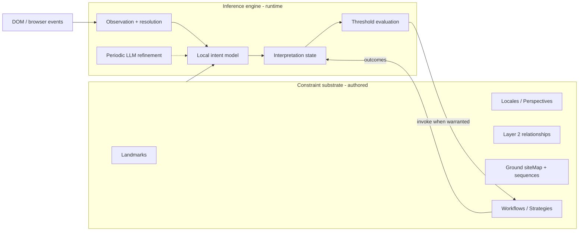

# DESIGN — User intent inference and entropy-gradient automation

**Status:** Design lock (not implemented). Operational spec for intent inference
and entropy-gradient triggers. The **qualified architectural thesis** is in
`DESIGN_substrate_constrains_agent.md` — read that first.
**Date:** 2026-05-26
**Relates to:** `DESIGN_user_action_classifier.md` (**prerequisite** — observation +
structured classification per event), `DESIGN_perspective_centric_flow.md`
(product story), `DESIGN_substrate_constrains_agent.md` (thesis),
`GROUND_SPEC.md`, `PAGEMODEL_SPEC.md`, `OUTCOMES_SPEC.md`, `DESIGN_llm_roles.md`.

**Scope note:** Runtime sections below describe **Phase C** only. Phase A
(intent → Perspective proposals) and Phase B (trial verification before accept)
are defined in `DESIGN_perspective_centric_flow.md`. Runtime hypothesis set =
**accepted Perspectives** on the Ground, not all site activities.

---

## 0. Locked decisions (operational — thesis in sibling doc)

These implement `DESIGN_substrate_constrains_agent.md` without restating its
preconditions (coverage, health, unmodeled policy, autonomy classes).

1. **Dual nature** — authored substrate + runtime belief engine + deterministic
   actuators via `CapabilityAPI` (inference **not built**).
2. **Entropy-gradient triggers** — policy accepts `TriggerProposal` when
   confidence + `substrateTrust` + `coverage` warrant it; anticipatory firing
   defaults to `suggest` / `prepare` only.
3. **No pre-authored Activity primitive** — posterior over structured labels, not
   template libraries.
4. **Hypothesis labels** — composed from **Perspective** + role + siteMap flow;
   user tags / Intent overlay when site vocabulary is insufficient.
5. **Layered inference** — hot local (&lt;50ms), warm LLM periodic, cold outcomes
   stream; LLM not per DOM event.
6. **Local-first default** for belief + evidence.
7. **Raw `user-*-landmark` events** are evidence; actuation listens to belief /
   interpretation events, not raw clicks.
8. **Separate event channels** — substrate health (`GroundEventBus`) vs session
   interpretation (new bus or namespace — do not mix drift with intent).

---

## 1. Problem statement

### 1.1 What exists today

| Layer | What it provides | Limitation for user-intent automation |
|-------|------------------|--------------------------------------|
| Locale / Perspective events | Page-state: `landmark-appeared`, predicate matched, locale active | Describes **consequences**, not **user cause** |
| Surface affordance events | Studio, chat, clock | Orchard UI only, not monitored page |
| Authoring-time observation | Picker demonstrations → effect annotations | Authoring, not runtime monitoring |
| Workflows `on-event` | Time-node matchers over architectural events | No continuous intent estimate |

The architecture has **substrate and event vocabulary** sufficient for
state-driven automation. It does **not** yet specify:

- Runtime observation of user page interactions resolved to landmarks
- A session-scoped **interpretation state** (distribution over user intent)
- Triggers keyed to **confidence / entropy**, not only discrete events
- The **probabilistic → deterministic** invocation interface

### 1.2 What we are not optimizing for

- **Isolated click watchers** — well-trodden; insufficient differentiated value
- **Pre-authored behavioral pattern libraries** — does not match emergent-intent
  framing; exponential authoring burden
- **LLM-in-the-loop on every DOM event** — infeasible at web interaction speeds
  (~100–300ms reactive budget; ~200ms anticipatory budget per evidence update)

### 1.3 Target value

Automation that participates in **intent formation**: the system narrows “what is
the user doing?” as evidence accumulates, and fires deterministic Workflows when
uncertainty drops below author- or policy-set thresholds — often **before** the
user completes the action.

---

## 2. Conceptual model

### 2.1 Native events vs architectural meaning

DOM and browser APIs emit rich events (target element, coordinates, modifiers,
navigation, tabs, etc.). A native click already identifies **which element** was
clicked at that moment.

The architectural gap is not “meaning from meaninglessness” but **continuity and
structure**:

| Information | Source |
|-------------|--------|
| User performed click / type / submit / … | Native / browser event |
| Which element, a11y name, DOM ancestry | Native event + DOM |
| Stable referent across time, users, reloads | Canonical landmark UID + resolver |
| Perspective membership, role in composition | Locale / Perspective / Layer 2 |
| Typical next steps, site-level flow position | Ground siteMap, inter-Locale sequences |
| Predicted side effects | Action effect annotations |

**Composed signal:** “user clicked `lmk_sign_in` in `loc_login_form` on
`gnd_example_com`” — not “user clicked `#sign-in-btn`.”

### 2.2 Emergent intent (not pattern matching)

**Rejected model:** Author Activity patterns → runtime matches event stream →
emit `activity-completed`.

**Adopted model:**

1. Raw page/browser events enter the **inference pipeline**
2. Each event resolves to zero or more **landmarks** (or records resolution failure)
3. Resolution + active Locales + Layer 2 + Ground structure **update a distribution**
   over plausible user intents
4. Entropy generally **decreases** as evidence accumulates; may **increase** when
   new evidence introduces ambiguity
5. When confidence / specificity crosses a threshold → emit **interpretation events**
6. Deterministic **Workflows** execute as actuators; results feed back as evidence

Meaning is **derived**, not **matched** to pre-specified templates.

### 2.3 Entropy framing

At session start on a Ground, the hypothesis space is wide (many activities
plausible). Each resolved interaction is evidence. Structural authoring acts as
**prior**:

- Active Locale set bounds perspectives in play
- Layer 2 `triggers`, `sequences`, `alternatives` bias likely transitions
- Ground siteMap sequences bias multi-Locale trajectories
- Authored **Intent** (Tier 3) is an explicit user-stated prior when present
- Effect annotations support **predicted-vs-observed** updates

**Automation lives on the gradient:** fire when
`P(topActivity) ≥ T` and/or `entropy ≤ E` (and optional stability:
`stableForMs`), not only when `eventKind === 'user-clicked-landmark'`.

---

## 3. Architecture: two components and their interface



### 3.1 Substrate responsibilities (deterministic, authored)

| Primitive | Role for inference |
|-----------|-------------------|
| Landmark (canonical UID) | Stable evidence attachment point |
| Locale / Perspective | Primary activity vocabulary; bounds hypothesis space |
| Layer 2 (role, triggers, sequences, alternatives, …) | Transition priors, flow position |
| Predicates | State observables; predicate transitions are evidence |
| Ground siteMap / inter-Locale edges | Site-level trajectory priors |
| Effect annotations | Hypothesis tests: predicted effect occurred or not |
| Intent (authored) | Strong explicit prior for related activities |
| Workflow / Strategy | Deterministic actuators; side-effect class drives threshold policy |

### 3.2 Inference engine responsibilities (probabilistic, runtime)

| Responsibility | Notes |
|----------------|-------|
| Observe | Content-script hooks; demand-driven where possible |
| Resolve | Event target → landmark UID(s); record failures |
| Maintain session trace | Bounded window + summarization; distinct from per-execution traces |
| Update distribution | Fast local model on substrate features |
| Refine | Periodic LLM (local or cloud); elaboration, vocabulary proposals |
| Emit interpretation events | Discrete events for Workflow composition |
| Invoke actuators | Call Workflow/Strategy when thresholds + consent allow |
| Learn | Corrections + outcomes → training partition (cold path) |

### 3.3 Probabilistic → deterministic interface

**Invocation record (conceptual):**

```typescript
type InferenceInvocation = {
  at: number;                          // timestamp
  topActivity: ActivityDescriptor;     // structured, substrate-derived
  confidence: number;                  // e.g. top-1 probability
  entropy: number;                     // distribution uncertainty
  stableForMs: number;
  matchedWorkflowIds: string[];
  consentLevel: 'infer' | 'trigger';   // which consent gate passed
};
```

**Workflow dispatch** uses existing operation invocation machinery; the novel
piece is the **matcher** over interpretation state (§ 5.3).

**Feedback:** Workflow success/failure, user undo, user correction → updates
session distribution and cold-path training.

---

## 4. Activity vocabulary (no Activity primitive)

### 4.1 Primary: substrate-derived descriptors

Activity labels are **structured records composed from primitives**, not a
separate authored type.

```typescript
type ActivityDescriptor = {
  primary: string;           // e.g. from active Locale name: 'checking-out'
  refinement?: string;       // e.g. 'providing-shipping-info' from role + focus
  flowPosition?: string;     // e.g. 'step-2-of-4' from authored sequence
  groundId: string;
  localeIds?: string[];      // active Locales contributing to label
  landmarkUid?: string;      // last resolving landmark, if any
  actionKind?: string;       // CLICK, TYPE, … when relevant
};
```

**Derivation rules (normative intent, implementation TBD):**

| Signal | Typical `primary` / `refinement` |
|--------|----------------------------------|
| Active Locale named “Checkout” | `checking-out` |
| TYPE on `role: search-query` in Search Locale | `searching` / `specifying-query` |
| CLICK `role: primary-action` in Checkout Locale | `completing-purchase` |
| Position in Ground/Locale authored sequence | `flowPosition` |
| Inter-Locale navigation matching siteMap edge | transition-aware refinement |

Workflow matchers target **fields** of `ActivityDescriptor`, not free-form LLM
strings on the hot path.

### 4.2 Secondary: LLM elaboration (not for matching)

Periodic refinement may produce natural-language context, e.g. “User is providing
shipping for a 3-item Amazon order, ~5 minutes engaged.” Used for **transparency
UI** and offline learning — **not** as the primary `on-event` filter key.

### 4.3 Tertiary: user-curated activity tags

When substrate vocabulary misses user-meaningful categories (“shopping-for-kids”,
“dissertation research”), users may add **tags** — lightweight overlays, not
Tier-1 affordances:

```typescript
type ActivityTag = {
  id: string;
  name: string;
  description?: string;
  conditions: {
    groundIds?: string[];
    localeIds?: string[];
    landmarksPresent?: string[];
    landmarksWithRole?: Array<{ role: string; withinLocaleId?: string }>;
  };
  intent?: string;
  authoringMetadata?: Record<string, unknown>;
};
```

At runtime: report substrate descriptor **and** matching tags. Workflows may
filter on `tagIds`.

### 4.4 Explicit non-goals

- No `activities/` tier-1 artifact tree parallel to Locales
- No requirement to pre-author activity patterns before recognition
- No closed global activity ontology required at v1 (bootstrap + per-Ground
  refinement is sufficient)

---

## 5. Events and Workflow composition

### 5.1 Evidence events (runtime infrastructure)

Locale-scoped, **opt-in / demand-driven** where possible: enable observation for
`(landmark, eventKind)` when a matcher or active inference requires it.

| Event kind | When | Payload (conceptual) |
|------------|------|-------------------------|
| `user-clicked-landmark` | click resolves to landmark | `localeUid`, `landmarkUid`, `timestamp`, modifiers, position |
| `user-typed-into-landmark` | input on landmark | `landmarkUid`, `valueAfter` (policy: respect password fields), `timestamp` |
| `user-submitted-form` | submit on form landmark | `formLandmarkUid`, field snapshot policy, `timestamp` |
| `user-focused-landmark` | focus | `landmarkUid`, `timestamp` |
| `user-scrolled-to-landmark` | scroll intersects landmark | `landmarkUid`, `timestamp` |
| `user-hovered-landmark` | dwell exceeds threshold | `landmarkUid`, `durationMs` |

These **update inference**; most Workflows do not subscribe directly.

Existing Locale **page-state** events remain: `landmark-appeared`, predicate
matched, `locale-active`, etc. They are evidence for **consequences**; user-* events
are evidence for **cause**.

### 5.2 Interpretation events (Workflow-facing)

Emitted by the inference engine (owner: **session** context — see § 6.1):

| Event kind | When |
|------------|------|
| `interpretation-updated` | Distribution changed materially |
| `interpretation-confidence-crossed` | Top activity prob crossed threshold (up or down) |
| `interpretation-narrowed` | Entropy fell below threshold |
| `interpretation-stabilized` | Top activity unchanged ≥ `stableForMs` |
| `activity-recognized` | Confidence/specificity sufficient to name intent |
| `activity-completed` | Recognized activity reached natural endpoint |
| `activity-abandoned` | Evidence contradicts or times out prior recognition |

### 5.3 Workflow matchers (entropy-gradient)

Extend time-node vocabulary with interpretation matchers (alongside existing
`on-event`):

```typescript
type InterpretationMatcher = {
  topActivity?: string | Partial<ActivityDescriptor>;
  confidenceAbove?: number;
  entropyBelow?: number;
  stableForMs?: number;
  activityProbabilityAbove?: { activity: string; value: number };
  tagId?: string;
  groundId?: string;
};
```

**Example — anticipatory assistance:**

```typescript
{
  nodeType: 'on-event',
  matcher: {
    eventKind: 'interpretation-confidence-crossed',
    filter: {
      topActivity: { primary: 'checking-out' },
      confidenceAbove: 0.85,
      stableForMs: 2000
    }
  },
  body: { nodeType: 'sequence', children: [/* prefetch, suggest, etc. */] }
}
```

**Threshold policy by side-effect class (recommended):**

| Workflow class | Typical threshold | Behavior |
|----------------|-------------------|----------|
| Background prefetch | moderate confidence | invisible if wrong |
| Suggestion / UI hint | moderate–high | dismissible |
| Irreversible / spend / send | very high confidence | confirm or Intent-gated |

---

## 6. Runtime design

### 6.1 Session-scoped state

| State | Scope | Purpose |
|-------|-------|---------|
| Session trace | browser session | Recent resolved events + summaries |
| Interpretation distribution | session (+ optional persisted prior with consent) | Live intent estimate |
| Observation demand set | session | Which (landmark, eventKind) pairs are wired |
| Active Locale set | tab / ground | Predicate evaluator output |

**Event ownership:** interpretation events are **session-owned** (not Locale-owned),
because activities may span Locales within a Ground. Locale-owned page-state events
unchanged.

### 6.2 Layered inference pipeline

| Layer | Latency budget | Mechanism |
|-------|----------------|-----------|
| **Hot** | &lt;50ms / evidence | DOM capture → resolve → feature vector → local model update → threshold check → emit |
| **Warm** | 0.5–5s, periodic | LLM refinement of distribution; propose tags / vocabulary; elaborate for UI |
| **Cold** | offline | Train local weights; update per-Ground priors; population baselines (consent) |

**Hot-path feature vector (illustrative):** `landmarkUid`, `role`, `localeIds[]`,
`predicateStates`, `recentSequenceHash`, `flowPosition`, `timeDeltaMs`,
`effectPredictionOutcome`, `resolutionFailed: boolean`.

**Not on hot path:** cloud LLM per event, multimodal screenshot analysis per
event, live cross-user queries.

### 6.3 Observation strategy

1. **Demand-driven:** wire listeners for `(landmark, interactionKind)` required
   by active interpretation matchers or explicit authoring opt-in
2. **Filter at content script:** ignore unresolvable/high-frequency noise
   (mousemove); debounce scroll/type
3. **Resolve against cached Ground substrate** for active tab
4. **Password / sensitive fields:** never capture values; emit interaction without
   payload content

### 6.4 Predicted-vs-observed effects

When user performs an Action with effect annotation, runtime records prediction
then compares to observed navigation/modal/thread outcome. Match → confidence
increase; mismatch → redistribute or flag substrate staleness.

---

## 7. Consent, transparency, and privacy

Granular consent levels (distinct toggles):

1. **Observe** — capture resolved interaction evidence
2. **Infer** — maintain interpretation distribution
3. **Trigger** — invoke Workflows from inference thresholds
4. **Share** — contribute anonymized outcomes to training / population priors

**Transparency surfaces (required before Trigger consent):**

- Current top activity + confidence + entropy
- Why (substrate fields contributing)
- Pause / disable inference
- Correction: “actually doing X” → immediate session update + training signal

**Defaults:** Observe+Infer local-only; Trigger and Share opt-in.

---

## 8. Training and LLM roles

| Signal | Use |
|--------|-----|
| User correction of interpretation | Hot-path relabel + cold-path model update |
| Workflow outcome after invocation | Threshold calibration per Ground / user |
| Authoring metadata (accept/reject substrate) | Improves priors indirectly |
| `activity-recognized` + subsequent behavior | Label quality for classify role |

Per `DESIGN_llm_roles.md`: runtime refinement is **classify** (bounded activity
labels) + **describe** (elaboration). Not **plan** or **propose** on the hot path.

---

## 9. Relationship to existing work

| Existing piece | Status under this design |
|----------------|-------------------------|
| Landmarks, resolver, picker | Required; unchanged purpose |
| Perspectives / Layer 2 | Required; priors strengthen inference |
| Ground siteMap § 7 | Required; cross-Locale priors |
| Workflows / Strategies | Actuators; gain interpretation matchers |
| Outcomes / training stream | Cold-path learning channel |
| Intent (Tier 3) | Explicit prior; dual with inferred intent |
| Chat / Studio surfaces | Host transparency + correction UX |

**Does not replace:** deterministic execution semantics, replayability, or user
authority over authored constraints.

---

## 10. Implementation phasing

| Phase | Deliverable |
|-------|-------------|
| **Now** | This design lock; evaluate substrate changes against “preserves inference” |
| **Near** | Session trace abstraction; evidence event kinds in catalog; demand-driven observation spec; interpretation event kinds; matcher schema |
| **Medium** | Local model feature API; threshold + side-effect policy; Studio interpretation panel |
| **Later** | Full inference engine; personalized models; population priors (consent) |

**Explicitly deferred:** Intent-scoped inference; cross-session activity recognition
without user consent; Activity primitive tier.

---

## 11. Open questions

1. **Distribution representation:** categorical only vs mixed with open elaboration
   channel?
2. **Ambiguity:** multiple high-probability activities — emit all, or force top-1?
3. **Cold start:** population bootstrap vs heuristic Markov priors from siteMap only?
4. **Persistence:** session-only interpretation vs encrypted cross-session prior?
5. **Matcher defaults:** global `confidenceAbove` / `entropyBelow` vs per-Ground?
6. **Correction UX:** chat command vs Studio panel vs inline banner?
7. **Tag authoring:** picker flow vs post-hoc Studio editor?

---

## 12. Summary

| Question | Answer |
|----------|--------|
| Is per-click automation the goal? | No — intent **sequences** and **collapsing entropy** are |
| Pre-authored Activity patterns? | No — emergent interpretation |
| Activity vocabulary source? | **Substrate** (Locale, roles, sequences) + optional **tags** |
| What triggers Workflows? | **Interpretation thresholds** + existing discrete events |
| Is web-speed feasible? | Yes, with **local hot path** + periodic LLM + offline learning |
| What is the architecture building toward? | **Substrate for a probabilistic agent** that acts via **deterministic** operations |

The foundational work already in flight (canonical landmarks, perspectives, Ground
siteMap, outcomes stream) is **correctly oriented**; this note makes the target
explicit so later decisions do not undermine the inference engine.
